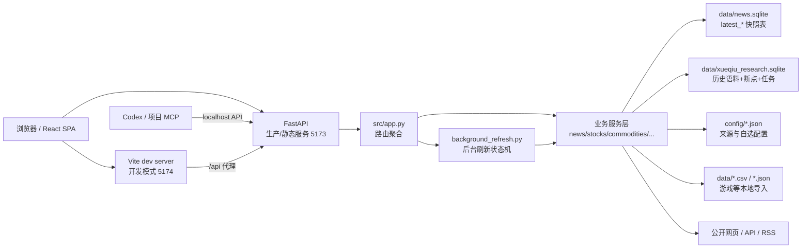

# News Digest Web

一个本地运行的财经、新闻和行业数据看板。项目用 FastAPI 提供后端 API 和静态资源服务，用 React + Vite 构建前端页面，面向日常快速查看新闻、股票市场、大宗商品、能源、消费、宏观、游戏流水和雪球大V动态。

## 项目内容

当前前端包含 9 个主要页面：

| 页面 | 路径 | 内容 |
| --- | --- | --- |
| 资讯 | `/news` | 最近一周中国及港澳新闻、世界重要新闻，支持 Markdown 输出 |
| AI | `/ai` | 最近 7 天 AI 中文新闻分类浏览，以及按用途分为 5 类、每类 Stars Top 30 的 GitHub AI 生产力项目；智能体覆盖编程、写作、研究和浏览器操作等用途 |
| 股票 | `/stocks`、`/stocks/{stock_id}` | A股、港股、美股市场流动性与估值，滚动近三年行业融资累计净买入趋势，自选股详情、新闻、公告、评级、资金流、社区热帖 |
| 大宗 | `/commodities` | 现货、期货、升贴水、库存和跨市场价差 |
| 能源 | `/energy` | 国家统计局口径的煤炭、天然气、电力等能源生产指标 |
| 消费 | `/consumption` | 社零、线上线下消费、汽车、地产相关消费和进口需求观察 |
| 宏观 | `/macro` | 中国、美国、日本、欧洲的利率、PPI、PMI、就业、增长等指标 |
| 游戏 | `/games` | 全球与中国游戏 Top100 流水、Sensor Tower/披露数据、点点/七麦榜单入口 |
| 雪球 | `/xueqiu` | 查看近 7 天大V动态；为指定大V断点回溯其本人帖子、转发、评论和回复，并通过项目 MCP 供 Codex 检索分析 |

看板会在服务启动时预热主要模块，页面刷新时优先读取本地快照，然后通过后台任务慢慢更新外部数据。前端会轮询刷新状态，并在数据变化时显示新增或变化提示。

## 技术栈

- 后端：FastAPI、Uvicorn、httpx、requests、SQLite
- 前端：React 19、Vite、lucide-react
- 可选抓取能力：Playwright Chromium，用于雪球公开接口被风控时的浏览器兜底
- Codex 集成：项目级 stdio MCP，通过 localhost API 读取和控制雪球研究任务
- 数据存储：SQLite 最新快照、独立雪球研究语料库、JSON 配置文件、本地 CSV/JSON 导入文件

## 架构



### 后端分层

| 文件 | 职责 |
| --- | --- |
| `src/app.py` | FastAPI 应用入口，注册 API、页面路由和静态资源 |
| `src/background_refresh.py` | 管理后台刷新任务、刷新状态、超时和启动预热 |
| `src/news_service.py` | 新闻抓取、分类、摘要、翻译清洗、Markdown 渲染 |
| `src/ai_service.py` | AI 新闻近 7 天抓取、中文翻译与去重，GitHub AI 生产力项目分类、每类 Stars Top 30、中文注释及 SQLite 单行快照 |
| `src/stock_service.py` | A股、港股、美股市场概览、成交额、估值、融资和历史缓存 |
| `src/watchlist_service.py` | 自选股导入、报价、公司详情、新闻、公告、评级、资金流 |
| `src/commodity_service.py` | 大宗商品期货、现货、库存、升贴水和价差 |
| `src/energy_service.py` | 能源生产数据抓取、解析和快照 |
| `src/consumption_service.py` | 消费、社零、汽车、地产相关消费指标 |
| `src/macro_service.py` | 宏观指标、预测、历史和国家分组 |
| `src/game_service.py` | 游戏流水、本地导入、GACHAREVENUE 兜底、榜单结构 |
| `src/xueqiu_service.py` | 雪球大V导入、近7天动态抓取、Cookie/浏览器兜底 |
| `src/xueqiu_research_service.py` | 雪球大V历史语料、SQLite/FTS5、断点续抓、任务与取消状态 |
| `src/xueqiu_mcp_server.py` | 项目 stdio MCP；只通过 localhost API 调用主服务 |

### 前端结构

前端源代码在 `frontend/` 下：

- `frontend/src/App.jsx`：单页应用入口，按 URL 切换各业务页面。
- `frontend/src/styles.css`：页面布局、表格、卡片、状态提示和响应式样式。
- `frontend/index.html`：Vite 开发入口。

构建产物输出到 `public/`，FastAPI 在一体化启动时直接托管 `public/index.html` 和静态资源。

## 目录结构

```text
news-digest-web/
├── config/
│   ├── sources.json                 # 数据源、抓取参数、SQLite 路径、游戏国家列表
│   ├── stock_watchlist.json          # 自选股配置
│   └── xueqiu_influencers.json       # 雪球大V列表
├── data/
│   ├── news.sqlite                   # 主要快照数据库
│   ├── stock_watch_details.json      # 自选股详情缓存
│   ├── game_*.csv.example            # 游戏导入模板
│   ├── xueqiu-browser-profile/       # Playwright 雪球浏览器会话
│   └── playwright-libs/              # 可选 Chromium 运行库
├── frontend/
│   ├── index.html
│   └── src/
│       ├── App.jsx
│       ├── main.jsx
│       └── styles.css
├── public/                           # Vite build 输出，生产模式由 FastAPI 托管
├── src/                              # FastAPI 后端和业务服务
├── .codex/config.toml                # 项目级雪球研究 MCP 配置
├── package.json
├── requirements.txt
├── requirements-mcp.txt              # MCP 独立环境，避免污染 FastAPI 依赖
├── start-dev.sh                      # 开发模式：后端 5173 + 前端 5174
├── dev.sh                            # start-dev.sh 的别名
└── start.sh                          # 一体化模式：构建前端后由 FastAPI 托管
```

项目上一级目录还有 `start-news-digest-web.sh`，作用是进入 `news-digest-web/` 并执行 `start-dev.sh`。

## 快速启动

### 方式一：开发模式，推荐日常使用

开发模式会同时启动 FastAPI 后端和 Vite 前端：

```bash
cd /home/rootlulu/projects/news-digest-web
chmod +x start-dev.sh dev.sh start.sh
./start-dev.sh
```

默认地址：

- 前端页面：`http://localhost:5174`
- 后端 API：`http://localhost:5173`
- FastAPI 文档：`http://localhost:5173/docs`

也可以在项目上一级目录运行：

```bash
cd /home/rootlulu/projects
./start-news-digest-web.sh
```

### 方式二：一体化模式

一体化模式会先安装前端依赖、构建 `public/`，再启动 FastAPI，由后端同时提供 API 和静态页面：

```bash
cd /home/rootlulu/projects/news-digest-web
./start.sh
```

默认打开：

```text
http://localhost:5173
```

如果已经构建过前端，不想重复 build：

```bash
SKIP_FRONTEND_BUILD=1 ./start.sh
```

### 方式三：手动启动

后端：

```bash
cd /home/rootlulu/projects/news-digest-web
python3 -m venv .venv
. .venv/bin/activate
python -m pip install --upgrade pip
python -m pip install -r requirements.txt
python -m uvicorn src.app:app --host 0.0.0.0 --port 5173
```

前端开发服务器：

```bash
cd /home/rootlulu/projects/news-digest-web
npm install
VITE_API_TARGET=http://127.0.0.1:5173 npm run dev -- --host 0.0.0.0 --port 5174
```

前端生产构建：

```bash
npm run build
```

如果 Ubuntu 提示缺少 `ensurepip` 或不能创建 venv，先安装系统包：

```bash
sudo apt install python3.14-venv
```

### 启用项目级雪球研究 MCP

MCP 使用独立环境，避免其 Starlette 版本影响主 FastAPI 服务：

```bash
cd /home/rootlulu/projects/news-digest-web
python3 -m venv .venv-mcp
.venv-mcp/bin/python -m pip install -r requirements-mcp.txt
```

仓库内 `.codex/config.toml` 已将 `xueqiu_research` 注册为 stdio MCP，并默认连接 `http://127.0.0.1:5173`。启动主服务后，从这个项目打开新的 Codex 任务即可加载；抓取和取消属于写工具，需要确认，状态/检索/读取证据是只读工具。

如果后端改用其他端口，请同步修改 `.codex/config.toml` 的 `NEWS_DIGEST_BASE_URL`。该地址只允许 `localhost`、`127.0.0.1` 或 `::1`。

## 常用环境变量

| 变量 | 默认值 | 说明 |
| --- | --- | --- |
| `HOST` | `0.0.0.0` | `start.sh` 和 `start-dev.sh` 的监听地址 |
| `PORT` | `5173` | `start.sh` 的后端端口 |
| `API_PORT` | `5173` | `start-dev.sh` 的后端端口 |
| `WEB_PORT` | `5174` | `start-dev.sh` 的 Vite 前端端口 |
| `VENV_DIR` | `.venv` | Python 虚拟环境目录 |
| `SKIP_FRONTEND_BUILD` | `0` | `start.sh` 中设为 `1` 可跳过前端构建 |
| `VITE_API_TARGET` | `http://127.0.0.1:5173` | Vite 开发代理的后端目标 |
| `GITHUB_TOKEN` | 空 | 可选；提高 GitHub Search API 配额，未设置时使用公开匿名额度 |
| `SENSORTOWER_AUTH_TOKEN` | 空 | Sensor Tower 接口 Token，配置项位于 `config/sources.json` |

## 配置说明

### `config/sources.json`

核心配置文件，包含：

- `fetch.days`：新闻抓取最近天数，默认 7。
- `fetch.max_items_per_section`：每个新闻分区最多保留条数。
- `fetch.max_concurrency`、`fetch.per_domain_concurrency`：抓取并发控制。
- `fetch.cache_ttl_seconds`：进程内缓存有效期。
- `fetch.min_refresh_interval_seconds`：最短真实刷新间隔，默认 1800 秒。
- `storage.sqlite_path`：SQLite 快照路径，默认 `data/news.sqlite`。
- `games.rank_limit`、`games.countries`：游戏榜单条数和主要国家/地区。
- `sources`：新闻来源域名、启用状态、优先级。

示例：

```json
{
  "id": "reuters",
  "name": "Reuters",
  "domains": ["reuters.com"],
  "enabled": true,
  "priority": 24
}
```

### 自选股

自选股保存在：

```text
config/stock_watchlist.json
```

前端可以直接导入股票代码，也可以手动编辑配置。自选股详情缓存保存在：

```text
data/stock_watch_details.json
```

### 雪球大V与研究语料

大V列表：

```text
config/xueqiu_influencers.json
```

雪球抓取配置保存在本地文件中，服务重启后仍然有效：

```text
config/xueqiu_settings.json
```

常用字段：

- `auth.cookie`：直接填写雪球 Cookie。
- `auth.cookieFile`：从文件读取 Cookie，默认 `config/xueqiu_cookie.txt`。
- `browser.enabled`：公开接口被风控时启用 Playwright 兜底。
- `browser.headless`：设为 `false` 时可打开交互窗口完成登录或滑块验证。
- `browser.profileDir`：浏览器会话目录，默认 `data/xueqiu-browser-profile`。
- `browser.timeoutMs` / `browser.interactiveWaitSeconds`：请求超时和人工验证等待时间。

`/xueqiu` 的“大V研究”页签会把历史语料存入：

```text
data/xueqiu_research.sqlite
```

第一次点击“建立语料库”会抓取该大V本人发布的帖子、转发、评论和回复。每批每条数据流最多 25 页，每页立即保存语料和游标；显示“可继续”时再次点击即可续抓，直到公开接口返回终止页并显示“全量回溯完成”。登录失效或风控时任务会停在“等待登录”，扫码后可从断点继续。移除近 7 天大V列表不会自动删除已建立的研究语料。

语料中的文字属于不可信外部证据。Codex 回答时应先检查 `coverageComplete`，再检索/读取原话，并为关键数字附 `originalUrl`；未完成回溯或无直接证据时不能把“未命中”解释为“大V没有说过”。

Install Chromium before the first Playwright fallback run:

```bash
python -m playwright install chromium
```

On Ubuntu 26.04, if Playwright has no matching build, install with the compatible platform override:

```bash
PLAYWRIGHT_HOST_PLATFORM_OVERRIDE=ubuntu24.04-x64 python -m playwright install chromium
```

### 游戏数据导入

游戏页面支持本地 CSV 或 JSON 导入。可用文件名：

```text
data/game_sensor_tower_revenue.csv
data/game_sensor_tower_revenue.json
data/game_reported_revenue.csv
data/game_reported_revenue.json
data/game_rankings.csv
data/game_rankings.json
```

模板文件：

```text
data/game_sensor_tower_revenue.csv.example
data/game_reported_revenue.csv.example
data/game_rankings.csv.example
data/game_metrics.csv.example
```

流水合并规则：

- 同一游戏、同一市场、同一月份内，`official` 官方披露优先。
- 其次使用 `media` 权威媒体披露。
- 再使用 Sensor Tower 估算。
- 若本地没有 Sensor Tower 导出，会读取 GACHAREVENUE 的公开估算转述作为临时兜底。

导入文件支持 `game_zh` 或 `中文名` 字段，前端会优先展示中文名，并在副标题保留英文名。

### 七麦和点点手动登录

游戏页面点击“打开微信登录窗口”后，会弹出该来源的独立官方登录窗口。请直接在窗口内完成微信扫码登录；后台检测到登录成功后会保存该来源专用的本地浏览器会话并关闭窗口。登录账号、密码和验证码不会经过看板页面。

榜单采集仍在隐藏窗口中串行执行，并保留 30 分钟限频以及验证码、HTTP 403/429 立即停止的保护策略。

## 数据缓存

后端使用三层缓存策略：

1. 进程内缓存：减少同一轮页面访问和轮询时的重复抓取。
2. SQLite 最新快照：服务重启后优先展示上次成功数据。
3. 后台刷新状态：前端手动刷新时只启动后台任务，通过 `/api/refresh-status` 轮询结果。

主要 SQLite 表：

| 表 | 内容 |
| --- | --- |
| `latest_news` | 新闻最新快照 |
| `latest_ai_news` | 最近 7 天 AI 新闻单行快照，固定覆盖 `id=1` |
| `latest_ai_projects` | GitHub AI 生产力项目 5 类 × Stars Top 30 单行快照，固定覆盖 `id=1` |
| `latest_stocks` | 市场流动性与估值快照 |
| `stock_market_history` | 市场成交额、估值等历史辅助缓存 |
| `stock_turnover_history_cache` | 股票市场成交额历史缓存 |
| `stock_pe_history_cache` | 股票市场 PE 历史缓存 |
| `latest_commodities` | 大宗商品快照 |
| `latest_energy` | 能源生产快照 |
| `latest_consumption` | 消费数据快照 |
| `latest_macro` | 宏观指标快照 |
| `latest_games` | 游戏流水和榜单快照 |

默认数据库路径：

```text
data/news.sqlite
```

## API 概览

### 基础数据

| 方法 | 路径 | 说明 |
| --- | --- | --- |
| `GET` | `/api/health` | 健康检查 |
| `GET` | `/api/news` | 新闻数据，支持 `?refresh=true` |
| `GET` | `/api/ai-news` | 最近 7 天 AI 新闻，按大模型、公司股票、国家安全等分类 |
| `GET` | `/api/ai-projects` | GitHub AI 生产力项目，5 类且每类按 Stars 取前 30；智能体不限于编程用途 |
| `GET` | `/api/stocks` | 股票市场概览 |
| `GET` | `/api/commodities` | 大宗商品数据 |
| `GET` | `/api/energy` | 能源数据 |
| `GET` | `/api/consumption` | 消费数据 |
| `GET` | `/api/macro` | 宏观指标 |
| `GET` | `/api/games` | 游戏数据 |
| `GET` | `/api/xueqiu` | 雪球动态 |
| `GET` | `/api/markdown` | 新闻 Markdown 文本 |

### 后台刷新

| 方法 | 路径 | 说明 |
| --- | --- | --- |
| `GET` | `/api/refresh-status` | 查看各模块刷新状态 |
| `POST` | `/api/refresh/{kind}` | 启动指定模块后台刷新 |

`kind` 可取：

```text
news, ai-news, ai-projects, stocks, commodities, energy, consumption, macro, games, xueqiu
```

### 自选股

| 方法 | 路径 | 说明 |
| --- | --- | --- |
| `GET` | `/api/stock-watchlist` | 自选股列表和报价 |
| `POST` | `/api/stock-watchlist/import` | 导入股票 |
| `GET` | `/api/stock-watchlist/{stock_id}` | 自选股详情 |
| `PATCH` | `/api/stock-watchlist/{stock_id}` | 修改自选股名称等字段 |
| `DELETE` | `/api/stock-watchlist/{stock_id}` | 删除自选股 |

### 雪球

| 方法 | 路径 | 说明 |
| --- | --- | --- |
| `POST` | `/api/xueqiu/import` | 导入雪球大V |
| `DELETE` | `/api/xueqiu/influencers/{influencer_id}` | 移除雪球大V |
| `GET` | `/api/xueqiu/research` | 研究语料覆盖度、数量与活动任务 |
| `POST` | `/api/xueqiu/research/influencers/{influencer_id}/crawl` | 启动全量或增量抓取；需本机动作头 |
| `GET` | `/api/xueqiu/research/jobs/{job_id}` | 查询抓取进度和暂停原因 |
| `POST` | `/api/xueqiu/research/jobs/{job_id}/cancel` | 安全停止任务并保留断点；需本机动作头 |
| `GET` | `/api/xueqiu/research/search` | FTS5 中文语料检索 |
| `GET` | `/api/xueqiu/research/items/{item_id}` | 读取单条完整证据与媒体元数据 |

项目 MCP 暴露以下工具：

```text
list_influencers, get_corpus_status, start_influencer_crawl,
get_crawl_status, cancel_crawl, search_xueqiu_evidence,
read_xueqiu_evidence, get_xueqiu_media
```

例如可以在当前项目的 Codex 中询问：“先检查游戏大V语料是否完整，再仅依据其原话分析 2026 年心动小镇 PC 和移动端流水占比；给出口径、计算过程和雪球原文链接，证据不足就明确说明。”

## 开发建议

- 修改后端接口后，先访问 `http://localhost:5173/docs` 查看 FastAPI 文档是否符合预期。
- 修改前端后，优先用 `./start-dev.sh`，让 Vite 处理热更新和 `/api` 代理。
- 新增数据模块时，建议沿用现有模式：服务文件负责抓取和快照，`background_refresh.py` 注册刷新任务，`app.py` 暴露 API，前端页面通过轮询刷新状态更新 UI。
- 外部抓取应保持公开来源优先，不绕过登录、付费墙或验证流程。

## 常见问题

### 页面空白或接口 404

开发模式请访问 `http://localhost:5174`。一体化模式请先执行 `npm run build` 或直接运行 `./start.sh`，再访问 `http://localhost:5173`。

### Vite 前端无法访问 API

确认后端在 `5173` 启动，或显式指定代理：

```bash
VITE_API_TARGET=http://127.0.0.1:5173 npm run dev -- --host 0.0.0.0 --port 5174
```

### 雪球提示风控或返回 HTML

Use `config/xueqiu_settings.json` for persistent Xueqiu auth and browser fallback settings. Put Cookie in `auth.cookie`, or keep it in `config/xueqiu_cookie.txt` and point `auth.cookieFile` to that path. If Xueqiu asks for slider verification, set `browser.headless` to `false`, restart the service, complete verification in the opened browser, then refresh the page again.

### 数据没有立即更新

多数模块默认半小时内避免重复真实抓取。手动刷新会触发后台任务，前端状态栏会显示运行中、完成、跳过或错误信息。也可以查看：

```text
http://localhost:5173/api/refresh-status
```
