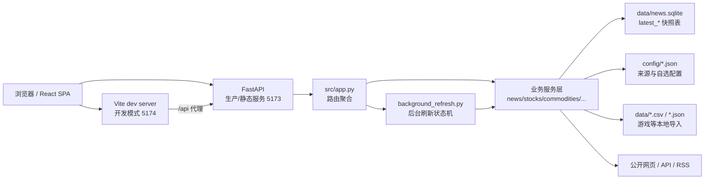

# News Digest Web

一个本地运行的财经、新闻和行业数据看板。项目用 FastAPI 提供后端 API 和静态资源服务，用 React + Vite 构建前端页面，面向日常快速查看新闻、股票市场、大宗商品、能源、消费、宏观、游戏流水和雪球大V动态。

## 项目内容

当前前端包含 8 个主要页面：

| 页面 | 路径 | 内容 |
| --- | --- | --- |
| 资讯 | `/news` | 最近一周中国及港澳新闻、世界重要新闻，支持 Markdown 输出 |
| 股票 | `/stocks`、`/stocks?tab=watchlist`、`/stocks/{stock_id}` | 大盘与个股双 Tab；A股、港股、美股市场流动性、融资、机构行业占比，以及自选股详情 |
| 大宗 | `/commodities` | 现货、期货、升贴水、库存和跨市场价差 |
| 能源 | `/energy` | 国家统计局口径的煤炭、天然气、电力等能源生产指标 |
| 消费 | `/consumption` | 社零、线上线下消费、汽车、地产相关消费和进口需求观察 |
| 宏观 | `/macro` | 中国、美国、日本、欧洲的利率、PPI、PMI、就业、增长等指标 |
| 游戏 | `/games` | 全球与中国游戏 Top100 流水、Sensor Tower/披露数据、点点/七麦榜单入口 |
| 雪球 | `/xueqiu` | 导入雪球大V，查看今天的帖子、评论、回复和转发 |

看板会在服务启动时预热主要模块，页面刷新时优先读取本地快照，然后通过后台任务慢慢更新外部数据。前端会轮询刷新状态，并在数据变化时显示新增或变化提示。

## 技术栈

- 后端：FastAPI、Uvicorn、httpx、requests、SQLite
- 前端：React 19、Vite、lucide-react
- 可选抓取能力：Playwright Chromium，用于雪球公开接口被风控时的浏览器兜底
- 数据存储：SQLite 最新快照、JSON 配置文件、本地 CSV/JSON 导入文件

## 架构



### 后端分层

| 文件 | 职责 |
| --- | --- |
| `src/app.py` | FastAPI 应用入口，注册 API、页面路由和静态资源 |
| `src/background_refresh.py` | 管理后台刷新任务、刷新状态、超时和启动预热 |
| `src/news_service.py` | 新闻抓取、分类、摘要、翻译清洗、Markdown 渲染 |
| `src/stock_service.py` | A股、港股、美股市场概览、成交额、估值、融资和历史缓存 |
| `src/watchlist_service.py` | 自选股导入、报价、公司详情、新闻、公告、评级、资金流 |
| `src/commodity_service.py` | 大宗商品期货、现货、库存、升贴水和价差 |
| `src/energy_service.py` | 能源生产数据抓取、解析和快照 |
| `src/consumption_service.py` | 消费、社零、汽车、地产相关消费指标 |
| `src/macro_service.py` | 宏观指标、预测、历史和国家分组 |
| `src/game_service.py` | 游戏流水、本地导入、GACHAREVENUE 兜底、榜单结构 |
| `src/xueqiu_service.py` | 雪球大V导入、今日动态抓取、Cookie/浏览器兜底 |

### 前端结构

前端源代码在 `frontend/` 下：

- `frontend/src/App.jsx`：单页应用入口，按 URL 切换各业务页面。
- `frontend/src/styles.css`：页面布局、表格、卡片、状态提示和响应式样式。
- `frontend/index.html`：Vite 开发入口。

构建产物输出到 `public/`，FastAPI 在一体化启动时直接托管 `public/index.html` 和静态资源。

## 目录结构

```text
news-digest-web/
├── config/
│   ├── sources.json                 # 数据源、抓取参数、SQLite 路径、游戏国家列表
│   ├── stock_watchlist.json          # 自选股配置
│   └── xueqiu_influencers.json       # 雪球大V列表
├── data/
│   ├── news.sqlite                   # 主要快照数据库
│   ├── stock_watch_details.json      # 自选股详情缓存
│   ├── game_*.csv.example            # 游戏导入模板
│   ├── xueqiu-browser-profile/       # Playwright 雪球浏览器会话
│   └── playwright-libs/              # 可选 Chromium 运行库
├── frontend/
│   ├── index.html
│   └── src/
│       ├── App.jsx
│       ├── main.jsx
│       └── styles.css
├── public/                           # Vite build 输出，生产模式由 FastAPI 托管
├── src/                              # FastAPI 后端和业务服务
├── package.json
├── requirements.txt
├── start-dev.sh                      # 开发模式：后端 5173 + 前端 5174
├── dev.sh                            # start-dev.sh 的别名
└── start.sh                          # 一体化模式：构建前端后由 FastAPI 托管
```

项目上一级目录还有 `start-news-digest-web.sh`，作用是进入 `news-digest-web/` 并执行 `start-dev.sh`。

## 快速启动

### 方式一：开发模式，推荐日常使用

开发模式会同时启动 FastAPI 后端和 Vite 前端：

```bash
cd /home/rootlulu/projects/news-digest-web
chmod +x start-dev.sh dev.sh start.sh
./start-dev.sh
```

默认地址：

- 前端页面：`http://localhost:5174`
- 后端 API：`http://localhost:5173`
- FastAPI 文档：`http://localhost:5173/docs`

也可以在项目上一级目录运行：

```bash
cd /home/rootlulu/projects
./start-news-digest-web.sh
```

### 方式二：一体化模式

一体化模式会先安装前端依赖、构建 `public/`，再启动 FastAPI，由后端同时提供 API 和静态页面：

```bash
cd /home/rootlulu/projects/news-digest-web
./start.sh
```

默认打开：

```text
http://localhost:5173
```

如果已经构建过前端，不想重复 build：

```bash
SKIP_FRONTEND_BUILD=1 ./start.sh
```

### 方式三：手动启动

后端：

```bash
cd /home/rootlulu/projects/news-digest-web
python3 -m venv .venv
. .venv/bin/activate
python -m pip install --upgrade pip
python -m pip install -r requirements.txt
python -m uvicorn src.app:app --host 0.0.0.0 --port 5173
```

前端开发服务器：

```bash
cd /home/rootlulu/projects/news-digest-web
npm install
VITE_API_TARGET=http://127.0.0.1:5173 npm run dev -- --host 0.0.0.0 --port 5174
```

前端生产构建：

```bash
npm run build
```

如果 Ubuntu 提示缺少 `ensurepip` 或不能创建 venv，先安装系统包：

```bash
sudo apt install python3.14-venv
```

## 常用环境变量

| 变量 | 默认值 | 说明 |
| --- | --- | --- |
| `HOST` | `0.0.0.0` | `start.sh` 和 `start-dev.sh` 的监听地址 |
| `PORT` | `5173` | `start.sh` 的后端端口 |
| `API_PORT` | `5173` | `start-dev.sh` 的后端端口 |
| `WEB_PORT` | `5174` | `start-dev.sh` 的 Vite 前端端口 |
| `VENV_DIR` | `.venv` | Python 虚拟环境目录 |
| `SKIP_FRONTEND_BUILD` | `0` | `start.sh` 中设为 `1` 可跳过前端构建 |
| `VITE_API_TARGET` | `http://127.0.0.1:5173` | Vite 开发代理的后端目标 |
| `SENSORTOWER_AUTH_TOKEN` | 空 | Sensor Tower 接口 Token，配置项位于 `config/sources.json` |
| `XUEQIU_COOKIE` | 空 | 雪球登录态 Cookie，可提高雪球接口成功率 |
| `XUEQIU_COOKIE_FILE` | `config/xueqiu_cookie.txt` | 从文件读取雪球登录态 Cookie，适合本地长期保存 |
| `XUEQIU_BROWSER` | `1` | 雪球接口失败时是否启用 Playwright 浏览器兜底，设为 `0` 关闭 |
| `XUEQIU_BROWSER_HEADLESS` | `1` | 设为 `0` 可打开有界面浏览器，手动完成登录或验证 |
| `XUEQIU_BROWSER_PROFILE_DIR` | `data/xueqiu-browser-profile` | 雪球浏览器会话目录 |
| `XUEQIU_BROWSER_EXECUTABLE` | 空 | 指定本机 Chrome/Chromium 可执行文件 |
| `XUEQIU_BROWSER_LIBRARY_PATH` | `data/playwright-libs/usr/lib/x86_64-linux-gnu` | Chromium 运行库目录 |
| `XUEQIU_BROWSER_TIMEOUT_MS` | `18000` | 雪球浏览器兜底请求超时 |
| `XUEQIU_BROWSER_LOCK_TIMEOUT_MS` | `XUEQIU_BROWSER_TIMEOUT_MS + 5000` | 多个刷新任务共用同一个浏览器 profile 时的等待时间 |

## 配置说明

### `config/sources.json`

核心配置文件，包含：

- `fetch.days`：新闻抓取最近天数，默认 7。
- `fetch.max_items_per_section`：每个新闻分区最多保留条数。
- `fetch.max_concurrency`、`fetch.per_domain_concurrency`：抓取并发控制。
- `fetch.cache_ttl_seconds`：进程内缓存有效期。
- `fetch.min_refresh_interval_seconds`：最短真实刷新间隔，默认 1800 秒。
- `storage.sqlite_path`：SQLite 快照路径，默认 `data/news.sqlite`。
- `games.rank_limit`、`games.countries`：游戏榜单条数和主要国家/地区。
- `sources`：新闻来源域名、启用状态、优先级。

示例：

```json
{
  "id": "reuters",
  "name": "Reuters",
  "domains": ["reuters.com"],
  "enabled": true,
  "priority": 24
}
```

### 股票页

股票功能分为两个子 Tab：

- `大盘`：A股、港股、美股市场流动性、估值、融资数据，以及公募基金、百亿私募、国家队、股票 ETF、社保基金、保险资金和 QFII 的申万一级行业占比。
- `个股`：原有自选股票列表、导入、改名、删除和公司详情；无选中股票时使用 `/stocks?tab=watchlist`，详情仍使用 `/stocks/{stock_id}`。

机构行业占比以各类资金当前展示样本的已披露持仓市值为分母。公募、国家队、社保、保险和 QFII 取披露市值前 500 只股票；ETF 取当前规模前 12 只境内股票 ETF；百亿私募使用公开的一季报前十大流通股东样本，未公开的其余 20 个行业合并展示。ETF 与公募等类别存在重叠，不能横向相加。

### 自选股

自选股保存在：

```text
config/stock_watchlist.json
```

前端可以直接导入股票代码，也可以手动编辑配置。自选股详情缓存保存在：

```text
data/stock_watch_details.json
```

### 雪球大V

雪球大V列表保存在：

```text
config/xueqiu_influencers.json
```

页面支持导入雪球主页链接、数字用户 ID 或昵称。若雪球公开接口返回风控页，可以设置 Cookie：

```bash
export XUEQIU_COOKIE='xq_a_token=...; u=...'
```

也可以把同样的 Cookie 字符串放进 `config/xueqiu_cookie.txt`，或通过 `XUEQIU_COOKIE_FILE=/path/to/cookie.txt` 指向其他文件。

也可以启用有界面浏览器手动登录一次：

```bash
XUEQIU_BROWSER_HEADLESS=0 ./start-dev.sh
```

第一次使用 Playwright 兜底时需要安装 Chromium：

```bash
python -m playwright install chromium
```

Ubuntu 26.04 如遇到 Playwright 暂无匹配构建，可使用兼容平台下载：

```bash
PLAYWRIGHT_HOST_PLATFORM_OVERRIDE=ubuntu24.04-x64 python -m playwright install chromium
```

### 游戏数据导入

游戏页面支持本地 CSV 或 JSON 导入。可用文件名：

```text
data/game_sensor_tower_revenue.csv
data/game_sensor_tower_revenue.json
data/game_reported_revenue.csv
data/game_reported_revenue.json
data/game_rankings.csv
data/game_rankings.json
```

模板文件：

```text
data/game_sensor_tower_revenue.csv.example
data/game_reported_revenue.csv.example
data/game_rankings.csv.example
data/game_metrics.csv.example
```

流水合并规则：

- 同一游戏、同一市场、同一月份内，`official` 官方披露优先。
- 其次使用 `media` 权威媒体披露。
- 再使用 Sensor Tower 估算。
- 若本地没有 Sensor Tower 导出，会读取 GACHAREVENUE 的公开估算转述作为临时兜底。

导入文件支持 `game_zh` 或 `中文名` 字段，前端会优先展示中文名，并在副标题保留英文名。

## 数据缓存

后端使用三层缓存策略：

1. 进程内缓存：减少同一轮页面访问和轮询时的重复抓取。
2. SQLite 最新快照：服务重启后优先展示上次成功数据。
3. 后台刷新状态：前端手动刷新时只启动后台任务，通过 `/api/refresh-status` 轮询结果。

主要 SQLite 表：

| 表 | 内容 |
| --- | --- |
| `latest_news` | 新闻最新快照 |
| `latest_stocks` | 市场流动性与估值快照 |
| `stock_market_history` | 市场成交额、估值等历史辅助缓存 |
| `stock_turnover_history_cache` | 股票市场成交额历史缓存 |
| `stock_pe_history_cache` | 股票市场 PE 历史缓存 |
| `latest_commodities` | 大宗商品快照 |
| `latest_energy` | 能源生产快照 |
| `latest_consumption` | 消费数据快照 |
| `latest_macro` | 宏观指标快照 |
| `latest_games` | 游戏流水和榜单快照 |

默认数据库路径：

```text
data/news.sqlite
```

## API 概览

### 基础数据

| 方法 | 路径 | 说明 |
| --- | --- | --- |
| `GET` | `/api/health` | 健康检查 |
| `GET` | `/api/news` | 新闻数据，支持 `?refresh=true` |
| `GET` | `/api/stocks` | 股票市场概览 |
| `GET` | `/api/commodities` | 大宗商品数据 |
| `GET` | `/api/energy` | 能源数据 |
| `GET` | `/api/consumption` | 消费数据 |
| `GET` | `/api/macro` | 宏观指标 |
| `GET` | `/api/games` | 游戏数据 |
| `GET` | `/api/xueqiu` | 雪球动态 |
| `GET` | `/api/markdown` | 新闻 Markdown 文本 |

### 后台刷新

| 方法 | 路径 | 说明 |
| --- | --- | --- |
| `GET` | `/api/refresh-status` | 查看各模块刷新状态 |
| `POST` | `/api/refresh/{kind}` | 启动指定模块后台刷新 |

`kind` 可取：

```text
news, stocks, commodities, energy, consumption, macro, games, xueqiu
```

### 自选股

| 方法 | 路径 | 说明 |
| --- | --- | --- |
| `GET` | `/api/stock-watchlist` | 自选股列表和报价 |
| `POST` | `/api/stock-watchlist/import` | 导入股票 |
| `GET` | `/api/stock-watchlist/{stock_id}` | 自选股详情 |
| `PATCH` | `/api/stock-watchlist/{stock_id}` | 修改自选股名称等字段 |
| `DELETE` | `/api/stock-watchlist/{stock_id}` | 删除自选股 |

### 雪球

| 方法 | 路径 | 说明 |
| --- | --- | --- |
| `POST` | `/api/xueqiu/import` | 导入雪球大V |
| `DELETE` | `/api/xueqiu/influencers/{influencer_id}` | 移除雪球大V |

## 开发建议

- 修改后端接口后，先访问 `http://localhost:5173/docs` 查看 FastAPI 文档是否符合预期。
- 修改前端后，优先用 `./start-dev.sh`，让 Vite 处理热更新和 `/api` 代理。
- 新增数据模块时，建议沿用现有模式：服务文件负责抓取和快照，`background_refresh.py` 注册刷新任务，`app.py` 暴露 API，前端页面通过轮询刷新状态更新 UI。
- 外部抓取应保持公开来源优先，不绕过登录、付费墙或验证流程。

## 常见问题

### 页面空白或接口 404

开发模式请访问 `http://localhost:5174`。一体化模式请先执行 `npm run build` 或直接运行 `./start.sh`，再访问 `http://localhost:5173`。

### Vite 前端无法访问 API

确认后端在 `5173` 启动，或显式指定代理：

```bash
VITE_API_TARGET=http://127.0.0.1:5173 npm run dev -- --host 0.0.0.0 --port 5174
```

### 雪球提示风控或返回 HTML

优先设置 `XUEQIU_COOKIE`，或把 Cookie 放到 `config/xueqiu_cookie.txt`。如果没有 Cookie，用 `XUEQIU_BROWSER_HEADLESS=0` 启动一次，手动完成登录或验证，后续会复用 `data/xueqiu-browser-profile`。

### 数据没有立即更新

多数模块默认半小时内避免重复真实抓取。手动刷新会触发后台任务，前端状态栏会显示运行中、完成、跳过或错误信息。也可以查看：

```text
http://localhost:5173/api/refresh-status
```
